# 🌐 Cas.in – WebGIS Sebaran SPKLU Teraktif Indonesia

[](https://flask.palletsprojects.com/)
[](https://postgis.net/)
[](https://supabase.com/)
[](https://leafletjs.com/)
[](https://opensource.org/licenses/MIT)

**Cas.in (Charging Indonesia)** adalah aplikasi **WebGIS Portofolio Kasus Nyata (Real-Case Portfolio Project)** interaktif yang dirancang untuk memetakan, memvisualisasikan, dan menganalisis sebaran Stasiun Pengisian Kendaraan Listrik Umum (SPKLU) di seluruh Indonesia. Proyek ini mengintegrasikan pemrosesan data spasial di tingkat server dengan antarmuka peta interaktif berkinerja tinggi di sisi klien.

---

## 📌 Fitur Utama Aplikasi

- **Visualisasi Interaktif (Leaflet.js):** Peta spasial dinamis dengan dark-mode tile, clustering marker otomatis untuk mengelompokkan ratusan titik SPKLU nasional, serta popup informasi detail stasiun.
- **Perutean Jalan & Koridor Spasial (OSRM Routing):** Memungkinkan pencarian lokasi SPKLU dalam radius koridor jalan nasional menggunakan buffer spasial sejauh 5 km di sepanjang rute perjalanan.
- **Dashboard Analitik (Chart.js):** Statistik spasial waktu nyata seperti rasio kepadatan SPKLU per 100.000 penduduk tingkat kota/kabupaten serta grafik sebaran operator SPKLU teraktif.
- **Pencarian Cepat & Filter Provinsi:** Navigasi cepat berbasis pencarian nama stasiun atau kota, serta penyaringan spasial per provinsi dan operator (PLN, Voltron, Hyundai, Wuling, dll.).

---

## 🏗️ Arsitektur Sistem & Alur Integrasi Spasial

Aplikasi ini menggunakan model arsitektur 3-tier spasial, menghubungkan data mentah hingga disajikan secara interaktif kepada pengguna akhir.

```mermaid
graph TD
    subgraph etl ["Data Acquisition & ETL"]
        RawData[Data Spasial Mentah: SHP / GeoJSON] --> |Standardisasi EPSG:4326| ETL[Proses ETL Spasial]
        Kemenhub[GIS Hub Kemenhub: Jaringan Jalan & Trans] --> ETL
        BPS[Peta Batas Wilayah BPS] --> ETL
    end

    subgraph db_cloud ["Database Spasial Cloud (Supabase)"]
        DB[(PostgreSQL + PostGIS)]
        ETL --> |Upload Data Tabel sebaran_spklu| DB
        DB --> |Spatial Indexing GIST| Index[Peningkatan Performa Spasial]
        DB --> |SQL Window Function Jittering| Jitter[Penguraian Koordinat Duplikat]
    end

    subgraph app_server ["Backend Application Server"]
        API[Flask REST API Server]
        Limiter[Flask-Limiter: API Throttling]
        Router[OSRM Engine: Routing / Buffer]
        API <--> Limiter
        API <--> Router
    end

    subgraph web_client ["Interactive Web Client"]
        UI[Leaflet.js Map Viewer]
        Chart[Chart.js: Dashboard Analitik]
    end

    DB <--> |Koneksi Spasial / SQL Query| API
    API <--> |JSON API / RESTful| UI
    UI <--> Chart
    User([Pengguna Akhir]) <--> |Interaksi Peta / Kueri Rute| UI

    style db_cloud fill:#0c0f1d,stroke:#3ECF8E,stroke-width:2px;
    style app_server fill:#1e2949,stroke:#60efff,stroke-width:2px;
    style web_client fill:#151e33,stroke:#ffd700,stroke-width:2px;
    style etl fill:#2a1b40,stroke:#a855f7,stroke-width:2px;
```



---

## 🛠️ Rekayasa Spasial & Tantangan Teknis yang Dipecahkan

### 1. Jittering Spasial Deterministik (SQL Level)
Satu stasiun fisik seringkali memiliki lebih dari satu mesin charger dengan tipe berbeda (AC/DC). Hal ini menyebabkan data tumpang-tindih (*overlapping points*) pada koordinat GPS yang sama persis. 

Untuk memecahkannya tanpa merusak data asli, kami mengimplementasikan fungsi jendela SQL (`ROW_NUMBER()`) dan rumus trigonometri melingkar (*circle jittering*) secara dinamis langsung di database PostGIS:

```sql
WITH ranked_spklu AS (
    SELECT gid, nama_spklu, latitude, longitude, geom,
           ROW_NUMBER() OVER (PARTITION BY latitude, longitude ORDER BY gid) AS rank
    FROM sebaran_spklu
)
SELECT ST_AsGeoJSON(
    CASE 
        WHEN rank = 1 THEN geom 
        ELSE ST_SetSRID(ST_MakePoint(
            longitude + 0.00008 * cos((rank - 1) * 1.04719755), 
            latitude + 0.00008 * sin((rank - 1) * 1.04719755)
        ), 4326) 
    END
) FROM ranked_spklu;
```
*Dampak:* Titik charger duplikat akan merenggang secara melingkar sejauh ~8.8 meter di sekeliling titik asli saat dizoom maksimal pada peta.

### 2. Standardisasi Wilayah Administratif (*Point-in-Polygon Join*)
Pembersihan data mentah dilakukan dengan melakukan pencocokan spasial (*spatial intersection*) koordinat titik SPKLU terhadap poligon resmi batas kota/kabupaten dan provinsi dari BPS yang disimpan dalam tabel database. Kolom masukan manual dihapus dan dialihkan ke kolom spasial terstandar `wadmkk` (kabupaten) dan `wadmpr` (provinsi) untuk menjamin akurasi data 100%.

### 3. Buffer Koridor Jalur Perjalanan
Mesin pencarian koridor jalan menggunakan buffer spasial 5 km di sekeliling garis jalur perjalanan (dihasilkan melalui OSRM Engine) untuk menyaring SPKLU terdekat dari rute mengemudi pengendara.

---

## 🚀 Panduan Instalasi Lokal

### Prasyarat
- Python 3.9 atau lebih baru
- Database PostgreSQL dengan ekstensi PostGIS (atau menggunakan koneksi Supabase Cloud)

### Langkah-Langkah

1. **Kloning Repositori:**
   ```bash
   git clone https://github.com/Ascalon231/webgis-spklu.git
   cd webgis-spklu
   ```

2. **Membuat Virtual Environment & Menginstal Dependensi:**
   ```bash
   python -m venv .venv
   source .venv/bin/activate  # Untuk Linux/macOS
   # .venv\Scripts\activate   # Untuk Windows
   
   pip install -r requirements.txt
   ```

3. **Konfigurasi Environment Variable (`.env`):**
   Buat file bernama `.env` di root folder proyek dan isi dengan kredensial database Anda:
   ```env
   DB_HOST=your-supabase-host.pooler.supabase.com
   DB_PORT=5432
   DB_NAME=postgres
   DB_USER=postgres
   DB_PASSWORD=your-secure-password
   FLASK_DEBUG=true
   ```

4. **Menjalankan Server Flask:**
   ```bash
   python app.py
   ```
   Aplikasi akan berjalan secara lokal di alamat `http://localhost:8500`.

---

## 📜 Lisensi & Atribusi Data

- **Lisensi Kode:** [Lisensi MIT](https://opensource.org/licenses/MIT) – Bebas digunakan untuk pengembangan akademis, edukasi, atau portofolio pribadi. Hak Cipta © 2026 **Ripan Nursalam**.
- **Sumber Data Spasial:**
  - **BPS & BIG:** Poligon spasial batas administratif kota/kabupaten dan provinsi Indonesia.
  - **GIS Hub Kemenhub:** Data spasial jaringan jalan nasional dan infrastruktur transportasi darat.
- **Peta & Perutean:**
  - **OpenStreetMap:** Data dasar jalan dan geocoding berlisensi terbuka **ODbL (Open Database License v1.0)**.
  - **CARTO:** Penyedia tile peta visual (*CartoDB Dark Matter*) berlisensi CC-BY-SA 2.0.

---

## 🤝 Kolaborasi & Kontak Diskusi

Proyek ini dibangun sebagai **prototype portofolio aktif** dengan integrasi database *serverless free tier*. Saya sangat terbuka untuk berdiskusi terkait kolaborasi komersial skala industri, rekayasa perangkat lunak WebGIS, maupun analisis spasial tingkat lanjut (*spatial data science*).

Silakan hubungi saya melalui:
- **LinkedIn:** [Ripan Nursalam](https://www.linkedin.com/in/ripan-nursalam/)
- **GitHub Profile:** [Ascalon231](https://github.com/Ascalon231)
- **Email:** [nursalamripan@gmail.com](mailto:nursalamripan@gmail.com)
